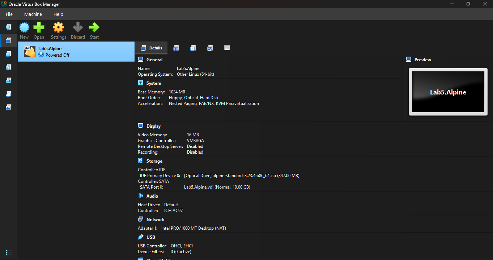
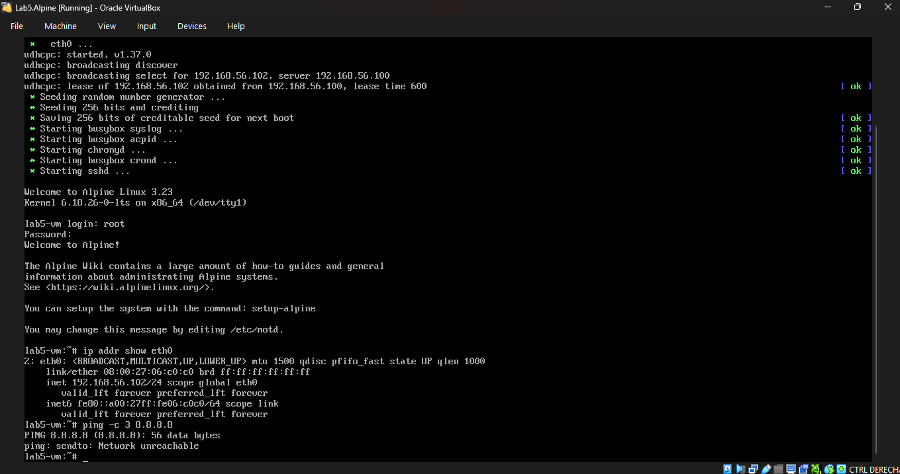
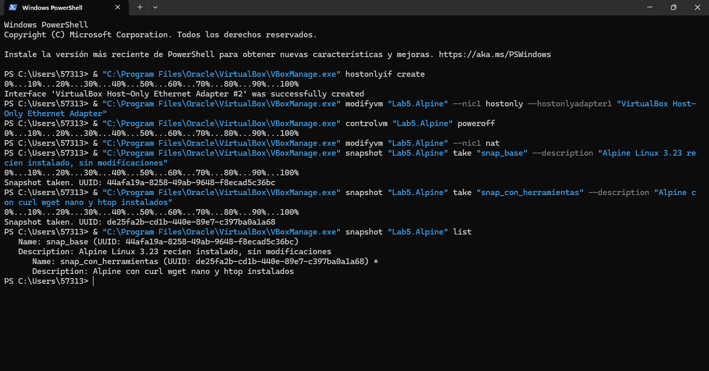
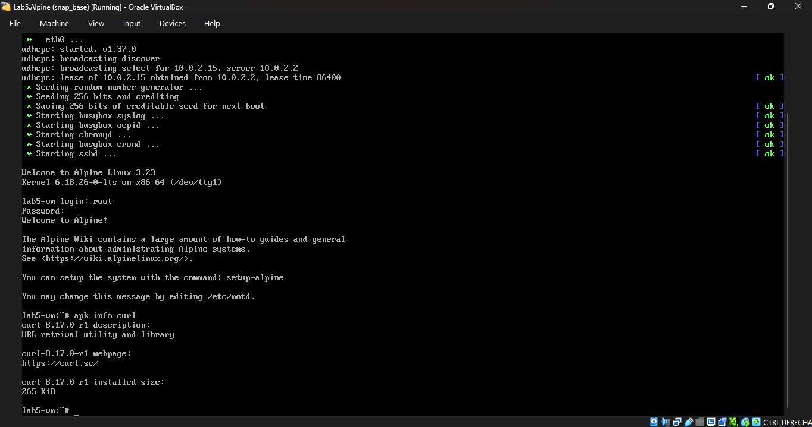
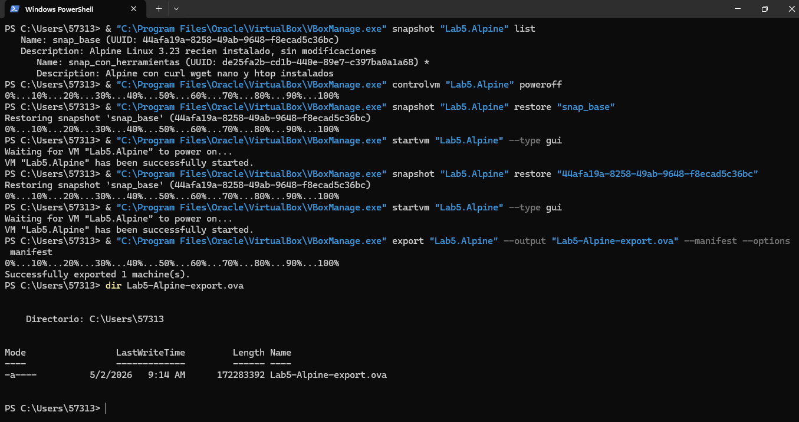

# Laboratorio 5 — VirtualBox y Máquinas Virtuales
**Estudiante:** Neidys Mariana Quintero Carrillo
**Curso:** Arquitectura de Computadores — Ingeniería de Sistemas  
**Universidad:** Francisco de Paula Santander  
**Año:** 2026

## Descripción
Este laboratorio consiste en la creación y configuración de una máquina virtual
Linux funcional usando VirtualBox. Se configuraron los modos de red disponibles
(NAT y Host-Only), se gestionaron snapshots del estado de la VM, se exportó la
VM en formato estándar OVA, y se documentó el proceso técnico completo en este
repositorio con capturas de pantalla verificables en cada fase.

---

## Entorno utilizado

| Componente | Versión / Detalle |
|---|---|
| Sistema operativo anfitrión | Windows [11] |
| VirtualBox | 7.x |
| SO de la máquina virtual | Alpine Linux 3.23 |
| Kernel | 6.18.26-0-lts x86_64 |
| RAM asignada a la VM | 1024 MB |
| Disco asignado a la VM | 10 GB VDI dinámico |
| Git | version 2.45.1.windows.1|

---

## Descripción de la VM creada

| Parámetro | Valor |
|---|---|
| Nombre | Lab5.Alpine |
| Sistema operativo | Other Linux (64-bit) |
| Memoria RAM | 1024 MB |
| Disco duro | Lab5.Alpine.vdi — 10 GB dinámico |
| Controlador de red | Intel PRO/1000 MT Desktop |
| Hostname | lab5-vm |
| Usuario | root |

---

## Estructura del repositorio
```
QuinteroCarrillo-post2-u5/
├── capturas/
│   ├── cp1_vm_config.png        # Checkpoint 1: configuración de la VM
│   ├── cp2_alpine_boot.png      # Checkpoint 2: Alpine operativo con IP NAT
│   ├── cp3_red_hostonly.png     # Checkpoint 3: ip addr en modo Host-Only
│   ├── cp4_snapshots.png        # Checkpoint 4: lista de snapshots
│   └── cp5_export_ova.png       # Checkpoint 5: archivo OVA exportado
├── VBoxManage_commands.sh       # Todos los comandos del laboratorio
└── README.md                    # Este archivo

```
---

## Pasos realizados

### Paso 1 — Creación de la máquina virtual

Se creó la VM Lab5.Alpine en VirtualBox con 1024 MB de RAM, disco VDI
dinámico de 10 GB y red en modo NAT. Se adjuntó la ISO de Alpine Linux 3.23
como unidad óptica para la instalación.



### Paso 2 — Instalación del sistema operativo

Se instaló Alpine Linux 3.23 usando el script `setup-alpine` con la siguiente
configuración: hostname `lab5-vm`, red por DHCP en eth0, zona horaria
`America/Bogota`, servidor SSH openssh, e instalación completa en disco `sda`.
Una vez finalizada la instalación se retiró la ISO y se verificó el arranque
desde disco duro.

La VM obtuvo la IP `10.0.2.15` por DHCP en modo NAT y se confirmó
conectividad a internet con ping a 8.8.8.8.


### Paso 3 — Configuración de modos de red

Se configuraron y verificaron dos modos de red distintos:

#### Tabla de IPs obtenidas por modo de red

| Modo de red | IP obtenida | Acceso a internet | Acceso desde anfitrión |
|---|---|---|---|
| NAT | 10.0.2.15 | Sí | No directo |
| Host-Only | 192.168.56.102 | No | Sí |

En modo NAT la VM accede a internet a través del anfitrión pero no es
accesible directamente desde él. En modo Host-Only la VM y el anfitrión
se comunican en una red aislada sin acceso a internet.



### Paso 4 — Gestión de snapshots

Se crearon dos snapshots del estado de la VM:

#### Árbol de snapshots

| Nombre | UUID | Descripción |
|---|---|---|
| snap_base | 44afa19a-8258-49ab-9648-f8ecad5c36bc | Alpine Linux 3.23 recién instalado |
| snap_con_herramientas | de25fa2b-cd1b-440e-89e7-c397ba0a1a68 | Alpine con curl, wget, nano y htop |

Se instaló software adicional (curl, wget, nano, htop) con `apk add` y se
tomó el segundo snapshot. Luego se restauró al `snap_base` verificando la
operación mediante el título de la ventana de VirtualBox que mostró
**(snap_base)** confirmando la restauración exitosa.




### Paso 5 — Exportación en formato OVA

Se exportó la VM en formato OVA (Open Virtualization Format) usando
VBoxManage. El archivo generado `Lab5-Alpine-export.ova` tiene un tamaño
de 172 MB y fue creado el 5/2/2026. Este archivo puede importarse en
cualquier instalación de VirtualBox o VMware para reproducir el entorno.

**Nota:** El archivo .ova no se incluye en el repositorio por su tamaño.



---

## Resultados obtenidos

| Checkpoint | Descripción | Estado |
|---|---|---|
| CP1 | VM Lab5.Alpine creada y configurada en VirtualBox | Completado |
| CP2 | Alpine Linux 3.23 instalado y operativo | Completado |
| CP3 | Modos NAT y Host-Only configurados y verificados | Completado |
| CP4 | Snapshots creados y restauración verificada | Completado |
| CP5 | VM exportada en formato OVA correctamente | Completado |

---

## Conclusiones

- La virtualización con VirtualBox permite crear entornos Linux completos
  sobre Windows sin modificar el sistema anfitrión, lo que facilita el
  aprendizaje y la experimentación en laboratorios de sistemas operativos.
- Los modos de red de VirtualBox tienen comportamientos técnicos distintos:
  NAT permite acceso a internet pero aísla la VM de la red local, mientras
  que Host-Only crea una red privada entre VM y anfitrión sin acceso externo.
- Los snapshots son una herramienta fundamental en entornos virtualizados
  ya que permiten guardar y restaurar el estado completo de la VM en segundos,
  eliminando el riesgo de dañar permanentemente el entorno de trabajo.
- El formato OVF/OVA es el estándar de la industria para distribuir máquinas
  virtuales de forma portable entre distintas plataformas de virtualización.
